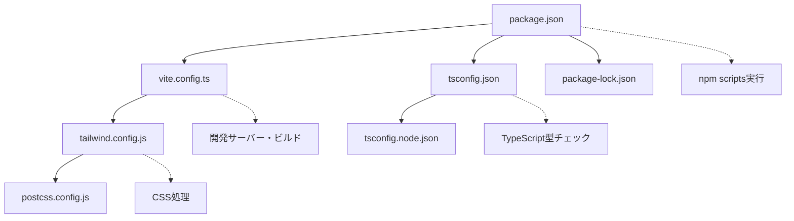

# プロジェクト設定ファイル解説

このドキュメントでは、プロジェクト内の各設定ファイルの役割と重要性について説明します。

## 🔧 設定ファイル一覧と役割

### 1. `package.json` - プロジェクト定義・依存関係管理
Node.jsプロジェクトの核となるファイルです。

**主な役割:**
- プロジェクトの基本情報（名前、バージョン、プライベート設定）
- 実行スクリプトの定義（dev, build, lint, preview）
- 依存パッケージの管理（本番用・開発用）
- プロジェクトタイプの指定（ES Modules）

**重要なポイント:**
```json
{
  "type": "module",           // ES Modules使用
  "scripts": {
    "dev": "vite",           // 開発サーバー起動
    "build": "tsc && vite build", // TypeScript→JavaScript変換 + ビルド
    "lint": "eslint ...",    // コード品質チェック
    "preview": "vite preview" // ビルド済みアプリのプレビュー
  }
}
```

### 2. `vite.config.ts` - Viteビルドツール設定
モダンなフロントエンド開発環境を提供するViteの設定ファイルです。

**主な役割:**
- React開発環境の設定
- バンドル・ビルドプロセスの定義
- 開発サーバーの動作設定

**現在の設定:**
```typescript
export default defineConfig({
  plugins: [react()],  // React支援プラグイン有効化
})
```

### 3. `tsconfig.json` - TypeScript設定（メイン）
TypeScriptコンパイラの設定を定義します。

**主な役割:**
- コンパイルターゲット（ES2020）の指定
- React JSXの設定
- 厳密な型チェックの有効化
- ソースコード（src/）の範囲指定

**重要な設定項目:**
```jsonc
{
  "compilerOptions": {
    "target": "ES2020",          // 出力するJavaScriptバージョン
    "jsx": "react-jsx",          // ReactのJSX変換方式
    "strict": true,              // 厳密な型チェック
    "noEmit": true,              // .jsファイル出力しない（Viteが担当）
    "moduleResolution": "bundler" // モジュール解決方式
  }
}
```

### 4. `tsconfig.node.json` - TypeScript設定（Node.js用）
Node.js環境（ビルドツール等）用のTypeScript設定です。

**主な役割:**
- Vite設定ファイル（vite.config.ts）用の型チェック
- Node.js環境特有の設定

**特徴:**
```jsonc
{
  "compilerOptions": {
    "composite": true,  // プロジェクト参照用
    "module": "ESNext"  // 最新のES Modules
  },
  "include": ["vite.config.ts"]  // 対象ファイル限定
}
```

### 5. `tailwind.config.js` - Tailwind CSS設定
ユーティリティファーストCSSフレームワークの設定ファイルです。

**主な役割:**
- スタイルの適用範囲指定
- カスタムテーマの定義
- 使用するプラグインの設定

**現在の設定:**
```javascript
export default {
  content: [
    "./index.html",
    "./src/**/*.{js,ts,jsx,tsx}",  // Tailwindを適用するファイル範囲
  ],
  theme: {
    extend: {},  // カスタムテーマ（現在は未使用）
  },
  plugins: [],   // 追加プラグイン（現在は未使用）
}
```

### 6. `postcss.config.js` - PostCSS設定
CSS後処理ツールの設定ファイルです。

**主な役割:**
- Tailwind CSSの処理
- ベンダープレフィックスの自動付与（Autoprefixer）

**設定内容:**
```javascript
export default {
  plugins: {
    tailwindcss: {},   // Tailwind CSS処理
    autoprefixer: {},  // ベンダープレフィックス自動付与
  },
}
```

### 7. `package-lock.json` - 依存関係固定
NPMが自動生成する依存関係の詳細情報ファイルです。

**主な役割:**
- 正確なパッケージバージョンの記録
- 依存関係ツリーの固定
- チーム開発時の環境統一

**注意点:**
- 手動編集は禁止
- バージョン管理に含める必要あり
- `npm install`時に自動更新

## 🔄 設定ファイル間の関係性



## 📝 設定変更時の注意点

### TypeScript設定変更
- `tsconfig.json`変更後はVSCodeの再起動を推奨
- 新しいライブラリ追加時は型定義の確認が必要

### Tailwind CSS設定変更
- `content`配列変更後は開発サーバーの再起動が必要
- カスタムテーマ追加時はIntelliSenseの確認

### Vite設定変更
- 設定変更後は開発サーバーの再起動が必須
- プラグイン追加時は依存関係のインストールが必要

## 🚀 開発フロー

1. **開発開始**: `npm run dev` → Viteが各設定を読み込み
2. **型チェック**: TypeScriptが`tsconfig.json`に従って実行
3. **スタイル処理**: PostCSS → Tailwind CSS → CSS出力
4. **ビルド**: `npm run build` → TypeScript変換 → Viteバンドル

これらの設定ファイルにより、モダンなReact + TypeScript + Tailwind CSS開発環境が実現されています。
